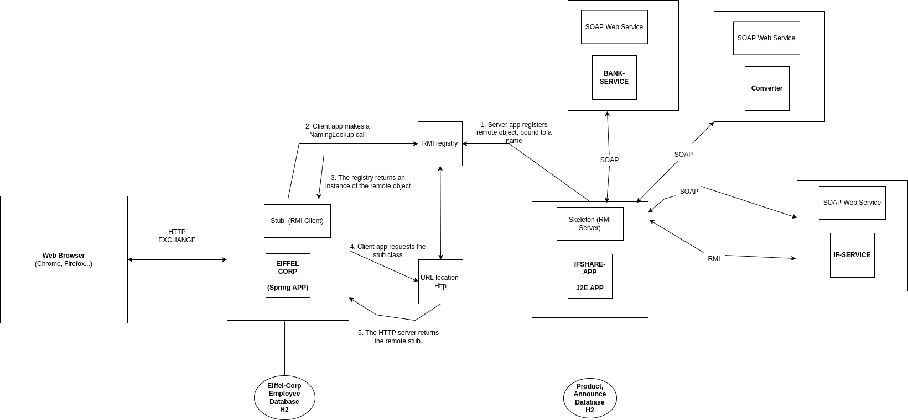

<h1 align="center"> RMI-WebService</h1>

<p align="center">
RMI-WEBSERVICES is a Application made up of several Java micro services for employees, to buy and resell products. This project is based on SOAP and RMI architecture. 
Employees can make purchases in multiple currencies, use a banking service, and use a foreign service to open the app to other users.
</p>


## Development

### Prerequisites

To run RMI-WebService you'll need the following tools installed

- [`Java JDK8`](https://www.oracle.com/fr/java/technologies/javase/javase8-archive-downloads.html)
- [`Maven`](https://maven.apache.org/)

### Installation

WIP...


## Architecture



RMI-WebService is organized through differents J2E applications, RMI architecture and SOAP services:

- [eiffel-corp](https://github.com/mbouazza-dev/RMI-WebService/tree/main/eiffel-corp)

- [ifshare-app](https://github.com/mbouazza-dev/RMI-WebService/tree/main/ifshare-app)

- [bank-service](https://github.com/mbouazza-dev/RMI-WebService/tree/main/bank-service)

- [if-service](https://github.com/mbouazza-dev/RMI-WebService/tree/main/if-service)

- [converter](http://webservices.currencysystem.com/currencyserver/)

### Eiffel-Corp 

Eiffel Corp is a Java application allowing employees to access company services including IfShare App.
It write with Spring framework and use Java RMI architecture to access IfShare-app features like the store and the mail notifier. 

Eiffel Corp use Thymeleaf and Spring to give a Web User Interface in order to sell and buy products. Employees must enter their username and password to access Eiffel Corp, Also, when a product is no longer on sale, it is possible to register in order to receive a notification during the restock.

The employee datas like email, firstname or login are stored in H2 database.

### IfShare-App

IfShare-App is a Java Application, it work with Eiffel-Corp in a Java RMI architecture to share Java Objects and features between them.

IfShare-App is responsible to store the products, the announces and the store in a H2 database. 
It share Data with some SOAP services and use them, for example to convert currencies, contact bank details and more.

IfShare-App stores its store Object in the RMI registry, so, Eiffel Corp and If-Service can use it.
The store it's accessible with the name storeService.

```Java
Naming.rebind("storeService", store);
``` 

Also, IfShare-App implement an Observer who use an EmailService. 
When an Announce does not have available product and a client want to be alert when the announce have a product again, Eiffel Corp use RMI shared methods to register the client in a Queue. IfShare send an email when the announce have a new product.

### Bank-Service

### If-Service

### Converter


## How to use
### Build

```shell
mvn package # in root directory
```

### Import this project in Eclipse

1. File > Import...
2. Maven > Existing Maven Projects
3. Browse to the root directory
4. Check that all modules are checked
5. Finish

